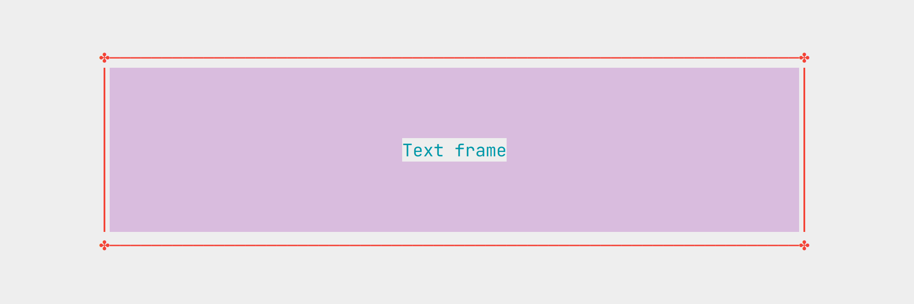

# txtframe

### Display text in a frame.


Displays text within predefined or custom frames.
You can set the frame color, change the text alignment.

### Examples

```rust

use txtframe::*;

let mut text_frame = TextFrame::new()
    .frame_var(&FrameVar::Space)
    .algn(Algn::Centr)
    .color_fra(Color::Red)
    .color_txt(Color::Cyan)
    .color_fill(Color::Magenta)
    .expand(0)
    .width(100)
    .expand_width(0)
    .expand_height(0)
    .left_top('✤')
    .right_top('✤')
    .left_btm('✤')
    .right_btm('✤')
    .top_line('―')
    .vert_left('│')
    .vert_right('│')
    .btm_line('―')
    .fill('░');
    
let text_frame_iter = text_frame.frame_iter("Text frame");
println!("{}", text_frame_iter.collect::<String>());
```


## License
GNU General Public License v3.0 


